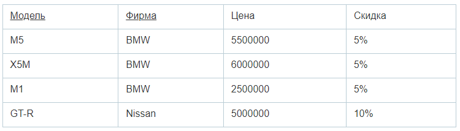

## Вопросы для подготовки к собеседованию по C#, платформе NET, алгоритмам и структурам данных на позицию Junior/Middle (Страница в разработке. Добавляются ответы на вопросы.)

- [Вопросы для подготовки к собеседованию по C#, платформе NET, алгоритмам и структурам данных на позицию Junior/Middle](#------------------------------------------c-------------net--------------------------------------------junior-middle)
  * [Core](#core)
  * [ООП](#ООП)
  * [Алгоритмы и структуры данных](#Алгоритмы-и-структуры-данных)
  * [Архитектура](#Архитектура)
  * [СУБД](#СУБД)
  * [Многопоточность:](#Многопоточность)

Если заметили неточности по ответу на вопрос пишите в телеграмм: [@VadSemenov](https://t.me/Vadsemenov)!

### Core

<details><summary>Вопрос 1. Что такое IL, CLR.</summary>

>IL (Intermediate Language) - это промежуточный язык, который создается компилятором .NET при компиляции исходного кода написанного на языке программирования C#, Visual Basic, F# или других языках, поддерживаемых .NET-ом. IL не является машинным кодом, он является переносимым кодом, который может быть выполнен на любой платформе, поддерживающей исполнение .NET-а.
>
>CLR (Common Language Runtime) - это среда исполнения .NET, которая контролирует управление памятью, управляет типами данных, обработкой исключений, выполнением потоков и другими аспектами, связанными с выполнением .NET-кода. CLR обеспечивает автоматическую управляемую память, что позволяет программистам работать на более высоком уровне абстракции и не заботиться о выделении и освобождении памяти.
>
>Когда .NET-приложение запускается, исполняемый файл (.exe или .dll) содержит IL-код. CLR загружает IL-код в память и компилирует его в нативный машинный код, т.е. код, который может быть выполнен процессором. Компиляция происходит JIT-компилятором, который компилирует IL-код на лету. Во время выполнения CLR контролирует работу приложения и осуществляет управление памятью. 
>
>В целом, IL и CLR являются ключевыми концепциями при разработке .NET-приложений, так как они обеспечивают переносимость и управление памятью для .NET-кода.
>
</details>

<details><summary>Вопрос 2. Что такое net Framework, net Standart, net Core и .NET. Хронология версий.</summary>

>.NET Framework – это платформа, которая предназначена для разработки и запуска приложений на языке программирования C# и других языков. Она была создана компанией Microsoft в 2002 году и предназначалась для работы в операционной системе Windows. Вышли версии начиная с 1.0 до 4.8. На данный момент новые версии не выпускаются.
>
>.NET Core – это открытая платформа, которая предназначена для разработки и запуска приложений на основе .NET. Он предназначен для работы на операционных системах Windows, Linux и macOS. Он был создан в 2014 году как более легковесная и гибкая альтернатива .NET Framework. Вышли версии с 1.0 до 3.1, далее сменила название на .NET.
>
>.NET – начиная с .NET 5, версии платформа стала называться .NET (без использования «Core» в названии), что символизирует объединение .NET Core, Mono и .NET Framework.
>
>.NET Standard – это набор API-интерфейсов, который определяет минимальные требования к реализации .NET-платформы. Он был создан в 2016 году для упрощения совместимости между различными реализациями .NET (.NET Framework и .NET Core(.NET)).
>
</details>

<details><summary>Вопрос 3. Какие в C# есть базовые типы данных их размер.
(byte, int, float и т.д.)</summary>

>В C# есть следующие базовые типы данных:

>1. Целочисленные типы:
>- sbyte (1 байт)
>- byte (1 байт)
>- short (2 байта)
>- ushort (2 байта)
>- int (4 байта)
>- uint (4 байта)
>- long (8 байт)
>- ulong (8 байт)
>
>2. Типы с плавающей точкой:
>- float (4 байта)
>- double (8 байт)
>- decimal (16 байт)
>
>3. Логический тип:
>- bool (1 байт)
>
>4. Символьные типы:
>- char (2 байта)
>
>5. Ссылочные типы:
>- object (размер зависит от типа объекта)
>- string (размер зависит от размера строки)
>
>Размеры типов данных могут варьироваться в зависимости от платформы (32- или 64-битная).
>
</details>

<details><summary>Вопрос 4. Чем ссылочные типы отличаются от значимых.</summary>

>Значимые типы (value types) хранятся в стеке памяти и оперируются напрямую, без использования указателей. Использование значимых типов экономит память, так как их значение хранится непосредственно в переменной. Таким образом, при передаче значимых типов в функцию происходит копирование их значений, что может быть ресурсоемкой операцией. Примерами значимых типов являются целые числа, логические значения, числа с плавающей точкой и т.д.
>
>Ссылочные типы (reference types) хранятся в куче памяти и оперируются через указатели на объекты. При создании переменной ссылочного типа выделяется только указатель, а на сам объект выделяется дополнительная память в куче. При передаче ссылочного типа в функцию происходит передача указателя на объект, а не его копии, что значительно экономит память. Примерами ссылочных типов являются строки, массивы, объекты классов и т.д.
>
>Также важно отметить, что ссылочные типы могут быть равны null, тогда как значимые типы всегда имеют значения по умолчанию, например, для int это 0, для bool - false и т.д.
>
</details>

<details><summary>Вопрос 5. Какие типы являются ссылочными, какие значимыми.</summary>

>Типы значений:
>
>Целочисленные типы (byte, sbyte, short, ushort, int, uint, long, ulong).
>- Типы с плавающей запятой (float, double).
>- Тип decimal.
>- Тип bool
>- Тип char
>- Перечисления enum
>- Структуры (struct)
>
>Ссылочные типы:
>
>- Тип object
>- Тип string
>- Классы (class)
>- Интерфейсы (interface)
>- Делегаты (delegate)
>
</details>

<details><summary>Вопрос 6. Какой класс родительский для всех типов? Какие он имеет методы.</summary>

>Класс родительский для всех типов в C# - это класс System.Object. Он имеет следующие методы:
>
>1. Equals - сравнение двух объектов на равенство
>2. GetHashCode - возвращает хеш-код объекта
>3. GetType - возвращает объект типа System.Type, представляющий тип текущего экземпляра
>4. ToString - возвращает строковое представление текущего объекта
>
>Кроме того, класс System.Object определяет также методы, связанные с управлением жизненным циклом объекта, такие как Finalize и MemberwiseClone.
>
</details>

<details><summary>Вопрос 7. Для чего нужны методы  Equals() и GetHashCode().</summary>

>Методы Equals() и GetHashCode() в C# нужны для работы с объектами и проверки их равенства. 
>
>Метод Equals() используется для сравнения двух объектов. При этом мы можем переопределить реализацию этого метода в нашем классе, чтобы определить собственные правила сравнения. Обычно этот метод сравнивает поля объектов, определяющие их состояние.
>
>Метод GetHashCode() возвращает хеш-код текущего объекта, основанный на его уникальных свойствах, что позволяет быстро идентифицировать объект в коллекциях, использующих хеш-таблицы. Этот метод тоже может быть переопределен в классе.
>
>Если hashCode у 2 объектов равен, они не обязательно равны (Equals). Но если объекты равны, то и hashCode должен быть у них одинаков. Возможность равенство хэшей объясняется возможной коллизией(совпадением) при вычислении хэшкода.
>
</details>

<details><summary>Вопрос 8. Как нужно переопределить Equals. Что такое Рефлексивность, 
Симметричность, Транзитивность в Equals.</summary>

>Переопределение Equals должно удовлетворять следующим условиям:
>
>- 1. Рефлексивность: любой объект должен быть равен самому себе (x.Equals(x) должен возвращать true).
>- 2. Симметричность: если объект x равен объекту y, то объект y также должен быть равен объекту x (x.Equals(y) должен возвращать true, если y.Equals(x) возвращает true).
>- 3. Транзитивность: если объект x равен объекту y, а объект y равен объекту z, то объект x должен быть равен объекту z (если x.Equals(y) возвращает true и y.Equals(z) возвращает true, то x.Equals(z) должен возвращать true).
>
>При переопределении Equals необходимо также переопределить метод GetHashCode для обеспечения совместимости с коллекциями, использующими хеширование объектов.
>Если hashCode у 2 объектов равен, они не обязательно равны (Equals). Но если объекты равны, то и hashCode должен быть у них одинаков. Возможность равенство хэшей объясняется возможной коллизией(совпадением) при вычислении хэшкода.

>Пример переопределения:
```csharp
 public class Person
{
    public string Name { get; set; }
    public int Age { get; set; }

    public override bool Equals(object obj)
    {
        if (obj == null || GetType() != obj.GetType())
        {
            return false;
        }
 
        if(this == obj)
        {
            return true;
        }
        
        Person other = (Person)obj;
        return Equals(Name, other.Name) && Age == other.Age; // сравниваем поля объектов
    }

    public override int GetHashCode()
    {
            int hash = 17;
            hash = hash * 23 + (Name != null ? Name.GetHashCode() : 0);
            hash = hash * 23 + Age;
            return hash;
    }
}
```
 
</details>

<details><summary>Вопрос 9. Как нужно переопределить GetHashCode.</summary>

>Когда переопределяется метод GetHashCode(), следует обратить внимание на следующие моменты:
>- 1. Возвращаемое значение метода GetHashCode() для двух эквивалентных объектов должно быть одинаковым.
>- 2. Метод GetHashCode() не должен генерировать исключения.
>
>Если hashCode у 2 объектов равен они не обязательно равны (Equals). Но если объекты равны, то и hashCode должен быть у них одинаков.
>Возможность равенство хэшей объясняется возможной коллизией(совпадением) при вычислении хэшкода.
>
>Пример переопределения:
```csharp
 public class Person
{
    public string Name { get; set; }
    public int Age { get; set; }

    public override bool Equals(object obj)
    {
        if (obj == null || GetType() != obj.GetType())
        {
            return false;
        }
 
        if(this == obj)
        {
            return true;
        }
        
        Person other = (Person)obj;
        return Equals(Name, other.Name) && Age == other.Age; // сравниваем поля объектов
    }

    public override int GetHashCode()
    {
            int hash = 17;
            hash = hash * 23 + (Name != null ? Name.GetHashCode() : 0);
            hash = hash * 23 + Age;
            return hash;
    }
}
```
 
</details>

<details><summary>Вопрос 10. Какие есть модификаторы доступа в C#.</summary>

>1. private — доступ открыт только для методов текущего класса;
>2. private protected - компонент класса доступен из любого места в своем классе или в производных классах, которые определены в той же сборке.
>3. file - добавлен в версии C# 11 и применяется к типам, например, классам и структурам. Класс или структура с такми модификатором доступны только из текущего файла кода.
>4. protected — такой компонент класса доступен из любого места в своем классе или в производных классах. При этом производные классы могут располагаться в других сборках;
>5. internal — такой компонент класса доступен из любого места в своем классе или в производных классах. При этом производные классы могут располагаться в других сборках;
>6. protected internal — совмещает функционал двух модификаторов protected и internal. Такой компонент класса доступен из любого места в текущей сборке и из производных классов, которые могут располагаться в других сборках.
>7. public — доступ открыт для всех классов и методов;
>
</details>

<details><summary>Вопрос 11. Ключевое слово ref. Какая разница при передаче ссылочных типов в методы с 
использованием ref и без.</summary>

>
>
</details>

<details><summary>Вопрос 12. Что такое дженерики, зачем нужны. Что такое ковариантность и 
контравариантность.</summary>

>
>
</details>

<details><summary>Вопрос 13. Что такое сериализация, какие виды сериализации есть в стандартных 
сборках net.</summary>

>
>
</details>

<details><summary>Вопрос 14. Для чего нужны интерфейсы IEnumerator и IEnumerable, как реализовать в 
классе.</summary>

>
>
</details>

<details><summary>Вопрос 15. Что такое методы расширения.</summary>

>
>
</details>

<details><summary>Вопрос 16. Что такое делегаты и события.</summary>

>
>
</details>

<details><summary>Вопрос 17. Что такое лямбды, как их использовать на примере делегатов.</summary>

>
>
</details>

<details><summary>Вопрос 18. Что такое Linq, основные методы.</summary>

>
>
</details>

<details><summary>Вопрос 19. Что такое атрибуты и зачем нужны.</summary>

>
>
</details>

<details><summary>Вопрос 20. Какие основные коллекции вы применяете, в чем преимущество каждой из 
них?</summary>

>
>
</details>

<details><summary>Вопрос 21. Расскажите про using и IDisposable, как они связаны.</summary>

>
>
</details>

<details><summary>Вопрос 22. Что такое деструктор класса, как работает.</summary>

>
>
</details>

<details><summary>Вопрос 23. Как работает сборщик мусора. Что такое LOH и SOH.</summary>

>
>
</details>

<details><summary>Вопрос 24. Нарисуйте иерархию основных коллекций в C#</summary>

>
>
</details>

### ООП

<details><summary>ООП Вопрос 1. Что такое ООП. Основные принципы ООП (Инкапсуляция, наследование, 
полиморфизм, абстракция).</summary>

>ООП (объектно-ориентированное программирование) - подход к программированию, основанный на использовании объектов, которые могут содержать данные и методы их обработки. ООП дает возможность создавать программы, ориентированные на объекты и их взаимодействие между собой, что делает код более организованным, гибким и легким в поддержке и модификации.
>
>Основные принципы ООП:
>
>1. Инкапсуляция - это механизм, который скрывает внутреннюю реализацию объекта и позволяет использовать этот объект только через определенный интерфейс. Таким образом, данные объекта могут быть доступны только через методы и свойства этого объекта.
>2. Наследование - это механизм, который позволяет создавать новый класс на основе уже существующего класса, наследуя его свойства и методы. Наследование позволяет сократить количество кода, улучшить его читабельность и поддерживаемость.
>3. Полиморфизм - это возможность одного метода или оператора иметь несколько форм или реализаций, в зависимости от типа объекта. Таким образом, разные объекты могут использовать одинаковые методы или свойства, но при этом они будут использоваться по-разному.
>4. Абстракция - это способ выделения общей сущности из множества конкретных объектов. Абстракция позволяет сконцентрироваться на существенных характеристиках объекта, а не на его деталях реализации. Через абстракцию создаются интерфейсы, которые могут быть использованы для обращения к различным объектам.
>
</details>

<details><summary>ООП Вопрос 2. Виды отношений между классами (Агрегация, Композиция, Ассоциативность).</summary>

>
>
</details>

<details><summary>ООП Вопрос 3. Расскажите и реализуйте интерфейсы IComparable и IComparator.</summary>

>
>
</details>

<details><summary>ООП Вопрос 4. Что такое переопределение и перекрытие методов, ключевое слово virtual.</summary>

>
>
</details>

<details><summary>ООП Вопрос 5. Для чего нужно ключевое слово sealed.</summary>

>Ключевое слово sealed в C# используется для запрета наследования класса или переопределения виртуальных методов  и свойств в производных классах. 
>
>То есть если класс помечен как sealed, это означает, что нельзя создавать новые классы, наследующие данный класс. Также нельзя переопределять виртуальные методы, которые объявлены в этом классе.
>
>Применение ключевого слова sealed может быть полезным в следующих случаях:
>- Когда необходимо запретить дальнейшее наследование и переопределение виртуальных методов в классах наследниках, чтобы гарантировать стабильность кода.
>- Когда требуется оптимизировать работу компилятора. Если компилятор знает, что класс помечен как sealed, он может оптимизировать код, уменьшив объем ненужных проверок во время выполнения программы.
>
>Примеры использования ключевого слова sealed:
```csharp
public sealed class MyClass
{
    // ...
}
```
>
```csharp
 class X
{
    protected virtual void F() { Console.WriteLine("X.F"); }
    protected virtual void F2() { Console.WriteLine("X.F2"); }
}

class Y : X
{
    sealed protected override void F() { Console.WriteLine("Y.F"); }
    protected override void F2() { Console.WriteLine("Y.F2"); }
}

class Z : Y
{
    // Невозможно переопределить F из-за ошибки compiler error CS0239.
    // protected override void F() { Console.WriteLine("Z.F"); }

    // Overriding F2 is allowed.
    protected override void F2() { Console.WriteLine("Z.F2"); }
}
```
>
</details>

<details><summary>ООП Вопрос 6. Чем интерфейс отличается от абстрактного класса.</summary>

>
>
</details>

<details><summary>ООП Вопрос 7. Отличие статического метода от обычного.</summary>

>
>
</details>

<details><summary>ООП Вопрос 8. Что такое статический конструктор, для чего нужен.</summary>

>
>
</details>

<details><summary>ООП Вопрос 9. Расскажите принципы Solid, покажите на примере.</summary>

>
>
</details>

### Алгоритмы и структуры данных

<details><summary>Алгоритмы Вопрос 1. Что такое сложность алгоритмов О(N).</summary>

>
>
</details>

<details><summary>Алгоритмы Вопрос 2. Реализовать бинарный поиск в массиве. Какая сложность алгоритма.</summary>

>
>
</details>

<details><summary>Алгоритмы Вопрос 3. Что такое Stack и Queue, какая есть реализация в C#. Что значит FIFO и 
LIFO.</summary>

>
>
</details>

<details><summary>Алгоритмы Вопрос 4. Реализовать одну из простых сортировок BubbleSort, InsertionSort, 
SelectionSort. Какая сложность этих алгоритмов.</summary>

>
>
</details>

<details><summary>Алгоритмы Вопрос 5. Что такое односвязный список и двусвязный список. Сложность для поиска, вставки. Какая есть реализация в 
C#</summary>

>
>
</details>

<details><summary>Алгоритмы Вопрос 6. Чем массив отличается списка или динамического массива, в чем недостатки.</summary>

>
>
</details>

<details><summary>Алгоритмы Вопрос 7. Что такое Бинарное дерево.</summary>

>
>
</details>

<details><summary>Алгоритмы Вопрос 8. Что такое самобалансирующиеся деревья AVL.</summary>

>
>
</details>

<details><summary>Алгоритмы Вопрос 9. Реализовать поиск в дереве в глубину и ширину.</summary>

>
>
</details>

<details><summary>Алгоритмы Вопрос 10. Что такое Хэш таблицы. Какая сложность поиска, вставки.</summary>

>
>
</details>

<details><summary>Алгоритмы Вопрос 7. Что такое множества, какие коллекции реализуют множество.</summary>

>
>
</details>

### Архитектура

<details><summary>Архитектура Вопрос 1. Какие есть основные типы паттернов (порождающие, структурные, 
поведенческие).</summary>

>
>
</details>

<details><summary>Архитектура Вопрос 2. Расскажите какие основные паттерны “Банды четырех” помните, как их 
реализовать.</summary>

>
>
</details>

<details><summary>Архитектура Вопрос 3. Расскажите про паттерн Prototype и интерфейс IClonable</summary>

>
>
</details>

<details><summary>Архитектура Вопрос 4. Расскажите как реализовать Singleton для многопоточного использования.</summary>

>
>
</details>

### СУБД

<details><summary>СУБД Вопрос 1. Что такое реляционные и нереляционные СУБД.</summary>

>Реляционные базы данных (СУБД) - это базы данных, в которых данные хранятся в виде таблиц, и каждая таблица связана с другой таблицей в базе данных отношениями. Реляционные базы данных используют язык SQL для извлечения и изменения данных. Примеры реляционных СУБД: MySQL, Oracle Database, Microsoft SQL Server, PostgreSQL, IBM Db2.
>
>Нереляционные базы данных (СУБД) - это базы данных, которые не используют таблицы и отношения для хранения данных, а хранят данные в различных форматах, таких как JSON, XML или графовые структуры. Нереляционные базы данных также называют базами данных NoSQL (not only SQL). Примеры нереляционных СУБД: MongoDB, Cassandra, Redis, HBase, Neo4j.
>
</details>

<details><summary>СУБД Вопрос 2. Что такое нормализация БД.</summary>

>Нормализация базы данных - это процесс организации данных в базе данных таким образом, чтобы избежать избыточности и повысить эффективность хранения и обработки данных. Цель нормализации - устранение аномалий при вставке, обновлении или удалении данных, а также обеспечение целостности данных. Нормализация помогает сделать структуру базы данных более логичной, уменьшить объем хранимых данных и улучшить производительность запросов к базе данных. Нормализация обычно выполняется путем разделения таблиц на более мелкие и более связанные между собой, чтобы избежать повторяющихся данных.
>
>Всего выделяют 6 нормальных форм. На практике обычно используют только первые 3.
>
>Каждая нормальная форма включает в себя предыдущую нормальную форму.
Нормальные формы обычно обозначаемых как 1НФ, 2НФ, 3НФ и т.д. Вот их краткое описание:

>1. Первая нормальная форма (1НФ): В этой нормальной форме все атрибуты в таблице должны быть атомарными, то есть не разделяться на более мелкие части. Кроме того, в таблице не должно быть повторяющихся столбцов или групп столбцов.
>
>До 1НФ:


>
>1НФ:


>
>2. Вторая нормальная форма (2НФ): Для того чтобы таблица находилась во второй нормальной форме, она должна быть в 1НФ, и каждый неключевой атрибут должен полностью зависеть от ключа таблицы. Если у нас есть составной ключ, то каждый неключевой атрибут должен зависеть от всех частей этого ключа.
>
>До 2НФ:



>
>2НФ:


>3. Третья нормальная форма (3НФ): Таблица находится в 3НФ, если она находится в 2НФ и неключевые атрибуты не зависят друг от друга. То есть, если у нас есть атрибут A, который зависит от атрибута B, и атрибут B зависит от атрибута C, то атрибут A должен зависеть от атрибута C через атрибут B. То есть каждое неключевое поле зависит 
именно от первичного ключа, а не от какого-то другого неключевого поля.
>
>До 3НФ:


>
>3НФ:


>4. Нормальная форма Бойса-Кодда (НФБК): Эта нормальная форма является улучшенной версией 3НФ и требует, чтобы каждый неключевой атрибут полностью зависел от ключа таблицы, и не должно быть нетривиальных функциональных зависимостей между кандидатскими ключами.

>5. Четвертая нормальная форма (4НФ): Эта нормальная форма связана с многозначными зависимостями и требует, чтобы таблица была в НФБК и не содержала многозначных зависимостей.

>6. Пятая нормальная форма (5НФ): Таблица находится в 5НФ, если она находится в 4НФ и не содержит зависимостей типа объединения.

>7. Шестая нормальная форма (6НФ): Таблица находится в 6НФ тогда и только тогда, когда она неприводима, то есть не может быть подвергнута дальнейшей декомпозиции без потерь.

Каждая из этих нормальных форм имеет свои правила и требования, и их применение позволяет улучшить структуру базы данных и избежать избыточности данных.
>

</details>

<details><summary>СУБД Вопрос 3. Что такое принципы ACID</summary>

>Принципы ACID (англ. Atomicity, Consistency, Isolation, Durability) - это набор требований, которые обязательно должны быть соблюдены при обработке транзакций в базе данных.
>
>- Атомарность (Atomicity) - это свойство транзакций, которое обеспечивает то, что все операции в рамках транзакции будут выполнены либо не будут выполнены вовсе. Транзакция должна быть выполнена целиком или не выполнена совсем.
>
>- Согласованность (Consistency) - это свойство транзакций, которое обеспечивает то, что база данных остается в согласованном состоянии после выполнения транзакции. Состояние базы данных должно соответствовать определенным правилам.
>
>- Изолированность (Isolation) - это свойство транзакций, которое обеспечивает то, что каждая транзакция выполняется независимо от других транзакций, и результаты одной транзакции не влияют на результаты других транзакций.
>
>- Надежность (Durability) - это свойство транзакций, которое обеспечивает сохранность изменений в базе данных после завершения транзакции. Изменения должны быть сохранены в случае сбоя системы или отказа устройств хранения данных.
>
</details>

<details><summary>СУБД Вопрос 4. Порядок выполнения операторов SQL (From- Join-Where-Group By-Having-
Select-Order by).</summary>

>В SQL порядок выполнения операторов определяется следующим образом:
>
>1. FROM
>2. ON
>3. JOIN
>4. WHERE
>5. GROUP BY
>6. WITH CUBE or WITH ROLLUP
>7. HAVING
>8. SELECT
>9. DISTINCT
>10. ORDER BY
>11. TOP (или LIMIT в некоторых БД)
>
>Этот порядок может варьироваться в зависимости от типа запроса, например, при использовании операторов INSERT, UPDATE или DELETE. Также порядок может изменяться при использовании скобок для задания приоритета операций.
>
</details>

<details><summary>СУБД Вопрос 5. Какие виды JOIN вы знаете. Как работает join.</summary>

>В SQL существует несколько видов операторов JOIN, которые позволяют объединять данные из разных таблиц:
>
>1. INNER JOIN: Возвращает только те строки, для которых есть соответствующие значения в обеих таблицах. То есть, если значение ключевого столбца в одной таблице имеет соответствие в другой таблице, то эти строки будут включены в результат.
>
>2. LEFT (OUTER) JOIN: Возвращает все строки из левой таблицы и соответствующие строки из правой таблицы. Если в правой таблице нет соответствующих строк, то будут возвращены NULL значения.
>
>3. RIGHT (OUTER) JOIN: Возвращает все строки из правой таблицы и соответствующие строки из левой таблицы. Если в левой таблице нет соответствующих строк, то будут возвращены NULL значения.
>
>4. FULL (OUTER) JOIN: Возвращает все строки из обеих таблиц. Если нет соответствующих строк в одной из таблиц, то будут возвращены NULL значения.
>
>5. CROSS JOIN: Возвращает декартово произведение всех строк из обеих таблиц. То есть, каждая строка из одной таблицы будет объединена со всеми строками из другой таблицы.
>
>Эти операторы позволяют объединять данные из разных таблиц на основе определенных условий и отношений между ними, что позволяет проводить сложные запросы к базе данных и получать необходимую информацию.
>
</details>

<details><summary>СУБД Вопрос 6. Что такое индексы.</summary>

>Индексы в базе данных (БД) - это структуры данных, созданные для ускорения поиска и доступа к данным в таблицах базы данных. Индексы позволяют быстро находить строки в таблице, основываясь на определенных столбцах или комбинациях столбцов, которые были проиндексированы.
>
>Индексы обычно используются для ускорения выполнения запросов SELECT, но также могут ускорять операции обновления и удаления данных, так как они позволяют базе данных быстрее находить и обрабатывать соответствующие строки.
>
>Создание индексов может быть полезным в случаях, когда таблица содержит большое количество данных или когда часто выполняются запросы, включающие поиск или сортировку по определенным столбцам.
>
>Однако следует помнить, что создание слишком большого количества индексов может привести к увеличению размера базы данных и замедлению операций обновления данных, поэтому необходимо балансировать использование индексов в базе данных.
>Для создания индекса в MySQL можно использовать следующий синтаксис:
>
```sql
CREATE INDEX index_name
ON table_name (column1, column2, ...);
```

>Например, чтобы создать индекс на столбце "name" таблицы "users", можно использовать следующий запрос:

```sql
CREATE INDEX name_index
ON users (name);
```

>Этот запрос создаст индекс с именем "name_index" на столбце "name" таблицы "users".
</details>

### Многопоточность

<details><summary>Многопоточность Вопрос 1. Как работает класс Thread и ThreadPool.</summary>

>Класс Thread в C# представляет отдельный поток выполнения. В основном, он используется для выполнения операций, которые можно отложить до тех пор, пока не завершится выполнение основного потока программы. Создание нового потока выполняется следующим образом:
```csharp
Thread thread = new Thread(functionName);
thread.Start();
```
>
>В этом примере создается новый поток, который будет выполнять функцию `functionName`, и запускается запускается его работа методом `Start()`. 
>
>Чтобы работать с пулом потоков, можно использовать класс `ThreadPool`. `ThreadPool` предоставляет реализацию пула потоков, которые могут выполнять асинхронные операции. `ThreadPool` бывает удобен в случае, когда нужно организовать выполнение нескольких задач параллельно, но без создания слишком большого количества потоков.
>
>Чтобы добавить задачу в пул потоков, используйте метод `QueueUserWorkItem`, который получает в качестве параметра делегат, выполняющий необходимую операцию:
```csharp
ThreadPool.QueueUserWorkItem(functionName);
```
>
>Таким образом, поток будет добавлен в пул и запущен на выполнение, когда будет готов свободный поток выполнения.
>
>При работе с потоками необходимо учитывать, что многопоточность может приводить к усложнению логики выполнения программы, поэтому необходимо строго контролировать общий доступ к общим ресурсам для избежания возможных проблем, таких как состояние гонки или дедлоки.
>
</details>

<details><summary>Многопоточность Вопрос 2. Что такое TPL.</summary>

>TPL (Task Parallel Library) - это библиотека, встроенная в .NET Framework, которая предоставляет эффективные и удобные средства для создания и управления параллельными задачами. Она была введена в .NET Framework 4.0 и предназначена для облегчения разработки многопоточных и параллельных приложений.
>
>Основной элемент TPL - это класс Task, который представляет асинхронную задачу, выполняемую в фоновом потоке. Задачи могут быть созданы как с использованием явных вызовов конструктора класса Task, так и с использованием метода Task.Run(). TPL также предоставляет механизмы для создания цепочек задач и управления зависимостями между ними.
>
>Многие методы, доступные для работы с задачами, используют LINQ-style синтаксис и предоставляют более высокоуровневые возможности для обработки и агрегации результатов задач. TPL также предоставляет средства для управления потоками выполнения, включая пул потоков и планировщик задач.
>
>В целом, TPL предоставляет мощный и удобный инструментарий для создания многопоточных и параллельных приложений в .NET Framework, уменьшая вероятность ошибок и упрощая процесс разработки.
>
>Основные элементы TPL (Task Parallel Library) в C#:
>
>1. Task (задача) - основной элемент TPL, представляет асинхронную задачу, выполняемую в фоновом потоке.
>2. TaskFactory (фабрика задач) - класс, позволяющий создавать и запускать задачи, а также контролировать их параметры.
>3. CancellationToken (токен отмены) - класс, который предоставляет механизм отмены задач при необходимости.
>4. Parallel (параллельный класс) - класс, который предоставляет методы для параллельного выполнения операций над коллекциями данных, методы для разделения задач на подзадачи, а также методы для обработки и агрегации результатов задач.
>5. AggregateException (исключение агрегации) - класс, который представляет исключение, возникающее при выполнении задачи или нескольких задач.
>6. TaskScheduler (планировщик задач) - класс, который позволяет настроить планирование задач, в том числе устанавливать приоритеты и настраивать пул потоков для выполнения задач. 
>
</details>

<details><summary>Многопоточность Вопрос 3. Для чего нужен async/await, как работает.</summary>

>Async/await в C# используется для асинхронного программирования. Обычно, когда мы выполняем какую-то операцию, она блокирует текущий поток выполнения, пока операция не будет завершена. Асинхронные операции позволяют выполнять код, не блокируя основной поток выполнения и не замедляя работу приложения. 
>
>Async/await позволяют написать асинхронный код, без создания большого количества потоков вручную и без необходимости обрабатывать сложные механизмы ожидания завершения задачи. Async/await позволяют писать код более легко и понятно. 
>
>Работа async/await осуществляется следующим образом: 
>1. Объявляем метод как асинхронный, указав ключевое слово async перед объявлением метода.
>2. В методе используем оператор await, который указывает, что нужно дождаться завершения асинхронной операции.
>3. Асинхронная операция может быть любой – это может быть сетевой запрос, работа с базой данных, обращение к внешнему API и так далее.
>4. Когда мы используем оператор await, поток, который вызвал асинхронный метод, освобождается от блокировки и может работать дальше, не дожидаясь завершения операции.
>
Пример:
```csharp
async Task DoSomethingAsync()
{
    var result = await SomeAsyncOperation();
    Console.WriteLine(result);
}
```
>Здесь метод DoSomethingAsync объявлен как асинхронный, внутри метода вызывается асинхронная операция SomeAsyncOperation(), и мы ожидаем, когда она завершится с помощью оператора await. Когда операция завершится, результат будет сохранен в переменной result и напечатан на консоль. 
>
>Важно понимать, что асинхронный код не обязательно быстрее синхронного – это зависит от реализации и от того, какие операции выполняются. Однако, асинхронный код может улучшить производительность и позволить более гладко работать с сетью или с базами данных.
>
</details>

<details><summary>Многопоточность Вопрос 4. Чем асинхронность отличается от многопоточности.</summary>

>Асинхронность и многопоточность - это две концепции, которые позволяют программе выполнять несколько задач одновременно. 
>
>Асинхронность позволяет программе продолжать работу, не ожидая завершения выполнения другой задачи. Это достигается с помощью использования асинхронных методов и операторов await/async, которые позволяют вызывать методы, не блокируя работу программы. Таким образом, асинхронность позволяет более эффективно использовать ресурсы компьютера, такие как процессорное время и память.
>
>Многопоточность, с другой стороны, позволяет программе выполнять несколько задач одновременно с помощью создания нескольких потоков выполнения. Каждый поток выполняет свою задачу параллельно с другими потоками. Это позволяет повысить производительность приложения, однако многопоточность также может привести к сложностям синхронизации доступа к общим ресурсам, таким как общая память или файлы.
>
>Таким образом, основным отличием между асинхронностью и многопоточностью является то, что асинхронность позволяет выполнять задачи, не блокируя работу программы, в то время как многопоточность позволяет выполнять несколько задач одновременно путем создания нескольких потоков выполнения.
>
</details>

<details><summary>Многопоточность Вопрос 5. Варианты запуска Task.</summary>

>1. Создать объект класса Task и вызвать метод Start():
```csharp
Task myTask = new Task(MyMethod);
myTask.Start();
```
>
>2. Вызвать метод Task.Run():
```csharp
Task.Run(() => {
    // код задачи
});
```
>
>3. Создать экземпляр класса TaskFactory и вызвать метод StartNew():
```csharp
TaskFactory factory = new TaskFactory();
factory.StartNew(() => {
    // код задачи
});
```
>
</details>

<details><summary>Многопоточность Вопрос 6. Что такое процесс, домен, поток.</summary>

>Процесс, домен и поток - это основные компоненты многопоточной обработки в языке программирования C#, которые играют важную роль при разработке больших и масштабных проектов.
>
>Процесс - это экземпляр запущенной программы в операционной системе, который выполняется в собственном адресном пространстве памяти. Каждый процесс существует независимо от других процессов, имеет свое собственное состояние и контекст исполнения. В C# процессы могут быть созданы и управляться через класс Process.
>
>Домен - это логическая группа сборок .NET, которая используется для управления изоляцией приложения и обеспечения безопасности. Каждый домен выполняется внутри процесса и может иметь свои собственные настройки безопасности, память и другие параметры. В C# домены могут быть созданы и управляться через класс AppDomain.
>
>Поток - это последовательность инструкций, которые выполняются в рамках процесса и домена. Каждый поток представляет отдельную нить исполнения внутри процесса и может выполнять свою работу независимо от других потоков. Потоки могут использоваться для выполнения множества асинхронных и параллельных задач в C#. В C# потоки могут быть созданы и управляться через классы Thread и ThreadPool.
>
>Использование процессов, доменов и потоков в C# позволяет разработчикам создавать масштабируемые и надежные приложения, которые могут эффективно использовать ресурсы компьютера и параллельно выполнять множество задач.
>
</details>

<details><summary>Многопоточность Вопрос 7. Какие способы синхронизации вы знаете.</summary>

>1. Оператор lock. Данный способ блокирует указанный объект до тех пор, пока другой поток не освободит его.
>2. Методы Monitor.Enter() и Monitor.Exit(). Этот способ является альтернативой оператору lock и позволяет осуществлять блокировку объекта и его освобождение явно.
>3. Использование класса SemaphoreSlim. Этот класс представляет из себя семафор – механизм, позволяющий ограничить количество потоков, работающих с определенным ресурсом.
>4. Использование класса ManualResetEventSlim. Этот класс представляет из себя средство сигнализации между различными потоками.
>5. Использование класса ReaderWriterLockSlim. Это способ синхронизации, который позволяет многим потокам иметь доступ к разделяемой переменной на чтение, но блокирует их на запись.
>6. Использование класса Interlocked. Это класс, который позволяет выполнить операции атомарного изменения значений переменных.
>7. Использование класса Mutex - механизм, позволяющий синхронизировать доступ к ресурсам между несколькими приложениями.
>8. Использование класса Semaphore - класс, обеспечивающий синхронизацию доступа к определенному количеству ресурсов.
>9. Использование класса AutoResetEvent - класс, который осуществляет автоматическое сброс события после его ожидания.
>10. Использование класса ManualResetEvent - класс, который предоставляет пользователю возможность явно сбрасывать событие после его ожидания.
>11. Использование класса CountdownEvent - класс, который обеспечивает синхронизацию между потоками, реализованный в виде обратного отсчета.
>12. Использование класса ReaderWriterLock - класс, который обеспечивает синхронизацию доступа к ресурсу, при этом ограничивая количество потоков, которые могут одновременно выполнять чтение или запись.
>13. Использование класса Barrier - класс, который обеспечивает синхронизацию выполнения задач в многопоточном приложении, позволяя запускать задачи только после завершения выполнения всех предыдущих задач.
>14. Использование класса SpinLock - класс, который обеспечивает быструю и эффективную синхронизацию доступа к разделяемым ресурсам.
>
</details>

<details><summary>Многопоточность Вопрос 8. Что такое DeadLock.</summary>

>Вот пример упрощенного deadlock на C#:
```csharp
using System;
using System.Threading;

class DeadlockExample
{
    static void Main()
    {
        object lock1 = new object();
        object lock2 = new object();

        new Thread(() =>
        {
            lock (lock1)
            {
                Console.WriteLine("Thread 1 acquired lock1");
                Thread.Sleep(1000);

                lock (lock2)
                {
                    Console.WriteLine("Thread 1 acquired lock2");
                }
            }
        }).Start();

        // Второй поток захватывает lock2, затем lock1 
        new Thread(() =>
        {
            lock (lock2)
            {
                Console.WriteLine("Thread 2 acquired lock2");
                Thread.Sleep(1000);

                lock (lock1)
                {
                    Console.WriteLine("Thread 2 acquired lock1");
                }
            }
        }).Start();

        Console.ReadKey();
    }
}
```
>
>Этот код создает два объекта блокировки `lock1` и `lock2` и создает два потока, каждый из которых пытается захватить эти объекты блокировки в определенном порядке. 
>
>Первый поток захватывает `lock1`, затем `lock2`, тогда как второй поток захватывает `lock2`, затем `lock1`. Это приводит к взаимоблокировке (deadlock), так как каждый поток ждет освобождения объекта блокировки, который удерживает другой поток. 
>
>Когда этот код выполняется, он приводит к замерзанию программы, так как оба потока застряли в бесконечном ожидании освобождения объекта блокировки. Чтобы исправить эту проблему, нужно перестроить логику потоков таким образом, чтобы они захватывали объекты блокировки в том же порядке.
>
</details>

<details><summary>Многопоточность Вопрос 9. Что такое Race Condition.</summary>

>Ниже приведен пример упрощенного Race Condition на C#:
```csharp
using System;
using System.Threading;

class Program
{
    static int count = 0;

    static void Main(string[] args)
    {
        for (int i = 0; i < 10; i++)
        {
            Thread thread = new Thread(IncrementCount);
            thread.Start();
        }

        Console.ReadLine();
    }

    static void IncrementCount()
    {
        for (int i = 0; i < 100000; i++)
        {
            count++;
        }
        Console.WriteLine("Count = {0}", count);
    }
}
```
>В этом примере создаются 10 потоков, каждый из которых инкрементирует глобальную переменную "count" 100000 раз. Из-за Race Condition результат выполнения этой программы будет непредсказуемым, поскольку два или более потоков могут попытаться изменить значение переменной "count" одновременно.
>
>Для предотвращения такой ситуации можно использовать механизмы синхронизации, такие как блокировки или мониторы, чтобы гарантировать, что только один поток имеет доступ к переменной "count" в любой момент времени.
>
</details>

<details><summary>Многопоточность Вопрос 10. Как реализовать паттерн Singleton для многопоточного использования.</summary>
 
 >Если требуется дополнительно обеспечить потокобезопасность в паттерне Singleton, можно использовать блокировку (lock) при создании экземпляра:
```csharp
public sealed class Singleton
{
    private static Singleton instance = null;
    private static readonly object syncRoot = new object();

    public static Singleton Instance 
    {
        get 
        {
            if (instance == null) 
            {
                lock (syncRoot) 
                {
                    if (instance == null)
                        instance = new Singleton();
                }
            }
            return instance;
        }
    }

    private Singleton()
    {
    }
}
```
>Здесь мы используем объект syncRoot для блокировки доступа к созданию экземпляра Singleton. Также используется проверка на null два раза с использованием блокировки с помощью lock. Это предотвращает создание нескольких экземпляров Singleton при использовании нескольких потоков.
</details>
 
